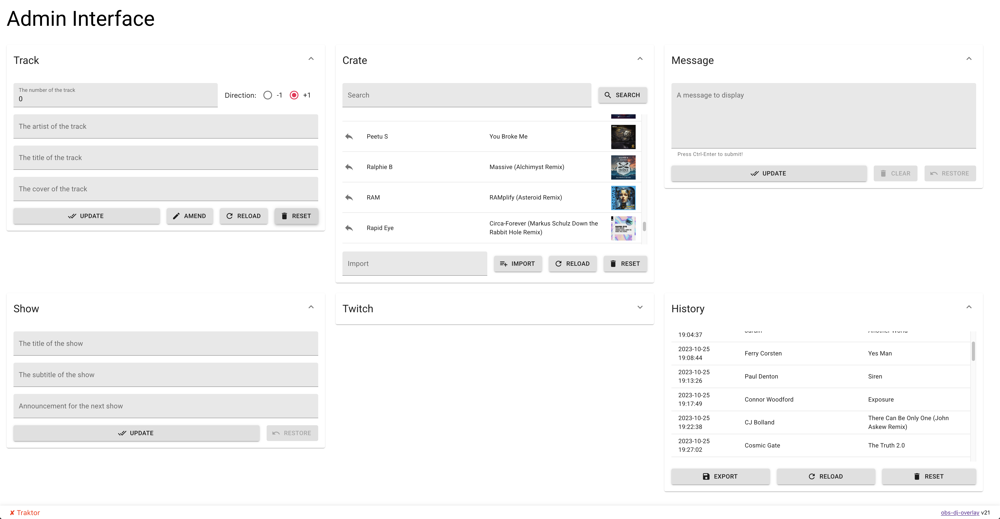

# obs-dj-overlay

*obs-dj-overlay* is a collection of small components that can
be used in combination with [OBS](https://obsproject.com/)’s
Browser source to render an overlay with various information.

It has been created with for DJs who are streaming music to
a video platform such as [Twitch](https://twitch.tv/) and who
want to include some information about the tracks they are
currently playing. The track information can be automatically
set by Traktor’s Broadcasting functionality.



This screenshot shows most of obs-dj-overlay’s features in
action. On the left side there are input fields for everything
you can change during runtime, on the right side there’s a
preview of the rendered overlay, the current stream on
Twitch and the Twitch chat.

The different sections in the admin interface are independent
from one another, i.e. you can change track info without at
the same time changing the show info. Modified fields are
shown in red to give a clear indication that unsaved data is
present.

The preview looks different from the Twitch stream because
OBS’s Browser source can apply custom CSS to the preview to
change its appearance.

## Configuring It

If you want to include a viewer count for a Twitch account
you need register an application with Twitch, generate a
client secret, copy `frontend/src/config.template.json` to
`frontend/src/config.json` and enter both client ID and client
secret in `frontend/src/config.json`.

You also need to enter the name of a Twitch channel for the
embedded chat and preview window. In most cases, that should
be your channel, and Twitch will ask you to login.

That’s it.

## Using It (Production Mode)

1. Compile the frontend:

    ```
   # cd frontend
   # yarn install && yarn build
   ```

1. Start the backend:

   ```
   # cd ..
   # npm install && npm start
   ```

    This will start obs-dj-overlay on port 5000. Open `http://localhost:5000`
    in your browser and start using it!

    If you want to use a different port than 5000, use:

    ```
   # PORT=12345 npm start
   ```

    To enable the included icecast server for use with Traktor, set the
    `ICECAST_PORT` environment variable:

    ``` sh
   # ICECAST_PORT=8000 npm start
   ```

   It is recommended to set Traktor to the smallest possible bitrate to
   reduce the amount of data that has to be sent over the network. The
   icecast server is not authenticated so make sure nobody but you can
   reach the port!

## Using It (Development Mode)

1. Start the backend:

    ```
   # npm install
   # npm start
   ```

1. Start the frontend:

    ```
    # cd frontend
    # yarn install
    # yarn start
    ```

1. A browser window should open, pointing to `http://localhost:3000/`.
You can click anywhere to get to the admin interface. You can also directly
head to `http://localhost:3000/admin` if your prefer.

## Embedding in OBS’s Docks

If you are using OBS on Windows you can define Docks in the UI which allow
you to embed websites in the OBS UI. For this, each of the sections of the
admin interface can be embedded. The URLs for the respective sections are:

* `/admin/embed/show`
* `/admin/embed/track`
* `/admin/embed/message`
* `/admin/embed/twitch`

OBS already offers docks for the Twitch chat and other information so you
don’t really need obs-dj-overlay’s admin view for that.

## Notes

This project is not yet quite production ready; while it does run for me I
can’t make any guarantees whatsoever for anybody else. The frontend is
still running in development mode (until I get the automatic proxying running
in production mode). Also, this project uses both npm and yarn, and how silly
is that, please?

## Customizing It

All data that is displayed can be modified from the web interface.
Different sections are defined and all data within a section is updated
at the same time and independent of data from other sections. That
means that you can change the message without updating it and then
change the track information without the message also being set.

All input fields have slightly modified behaviour to allow an improved
workflow.

* All text of an input field will be selected if an input field is clicked or
navigated to, allowing easy replacement of all text.
* Pressing enter will only send the data to the backend once you are in
the last input field of the section. This allows very convenient multi-field
data entry without sending intermediate state (i.e. updated artist but old
title of a track) to the backend (and the rendered overlay). However, this
is not the case for the “Track” section because I have noticed it’s very easy
to submit new track information way too early so in the track section you
have to use the “Update” button.
* When the track number is not 0 and the artist and/or track is changed,
the track number is automatically incremented or decremented (according
to the selected radio button) after being submitted, i.e. the number you see
in the interface is the number being sent to the backend on the next update.
* The message has a multi-line input field that can be sent using
Ctrl-Enter, after which all of the text will be selected for easy
replacement. (This doesn’t seem to work on Windows, though.)

In OBS you can apply a CSS override in the Browser source’s
configuration. The following classes are used by the rendered overlay: 

* `Viewer`: Main CSS class, font properties are defined here.
* `Background`: Defines the background image.
* `TitleInfo` (contains `Title` and `Subtitle`): Controls display of
the title information.
* `Clock`: Controls display of the clock.
* `TwitchViewerCount` (contains `Icon` and `Count`): Controls
display of the Twitch viewer count.
* `TrackInfo` (contains `Number`, `Artist`, `Title`, and `LastTrack`, the
latter containing `LastArtist` and `LastTitle`): Controls display of the track
information.
* `Message` (contains `Text`): Controls display of the message.
* `NextShow` (contains `Text`): Controls display of the “next
show” announcement.
